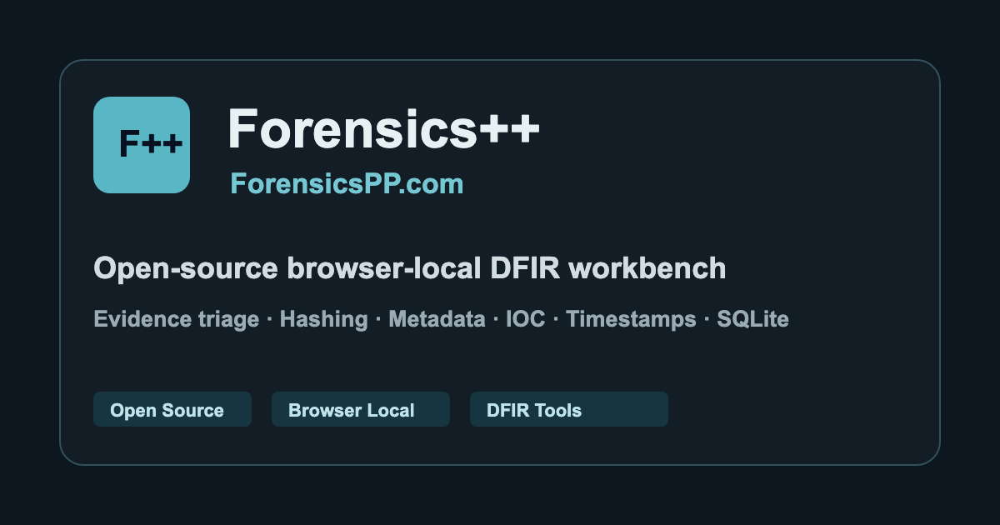
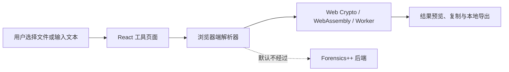

<div align="center">
  <a href="https://www.forensicspp.com/">
    
  </a>

  <h1>Forensics++ Workbench</h1>

  <p><strong>开源、浏览器本地运行的电子数据取证与证据初检工具站</strong></p>
  <p>Open-source browser-local DFIR tools for evidence triage.</p>

  <p>
    <a href="https://www.forensicspp.com/"></a>
    <a href="./LICENSE"></a>
    
    
    
    <a href="https://github.com/DyNooob/ForensicsPP/actions/workflows/ci.yml"></a>
    <a href="https://github.com/DyNooob/ForensicsPP/actions/workflows/pages.yml"></a>
  </p>

  <p>
    <a href="https://www.forensicspp.com/">在线使用</a>
    · <a href="#快速开始">快速开始</a>
    · <a href="#工具能力">工具能力</a>
    · <a href="#部署">部署</a>
    · <a href="./CONTRIBUTING.md">参与贡献</a>
  </p>
</div>

> [!IMPORTANT]
> Forensics++ `v0.6.0` 的工具输出用于辅助分析和快速初检，不应替代原始检材、标准取证流程或经过验证的专业软件。

## 项目概览

Forensics++ / ForensicsPP 是一个静态 React 应用。文件、文本和数据库由浏览器端代码处理，正常使用不需要 Forensics++ 后端、账号、API Key 或服务器数据库。

本仓库从 `v0.5` 起保存**完整源码**。早期版本直接提交构建后的 HTML、CSS 和 JavaScript；现在 `main` 分支保存 TypeScript、React 组件、构建脚本、静态资源和文档，GitHub Actions 在每次发布时自动生成并部署 `dist/`。

| 原则 | 实现方式 |
| --- | --- |
| Browser Local | 核心工具在浏览器中读取和处理输入，不调用 Forensics++ 后端。 |
| Explicit Actions | 选择输入、执行分析、复制或导出均由用户明确触发。 |
| Evidence-Oriented | 结果强调可复核的字段、偏移、哈希、时间和结构信息。 |
| Fully Open Source | 前端源码、构建配置、静态页面、Worker 和依赖声明均在本仓库中。 |

## 工具能力

<table>
  <thead>
    <tr>
      <th>方向</th>
      <th>主要工具</th>
      <th>核心能力</th>
    </tr>
  </thead>
  <tbody>
    <tr>
      <td><strong>文件与完整性</strong></td>
      <td>文件哈希、文件头、字符串、熵、二进制头</td>
      <td>批量摘要、哈希比对、签名识别、ASCII/UTF-16LE 字符串、PE/ELF/Mach-O 基础结构</td>
    </tr>
    <tr>
      <td><strong>图片与容器</strong></td>
      <td>图片工作台、PNG、二维码、压缩包</td>
      <td>EXIF、通道与低位视图、PNG chunks、尾部数据、二维码识别、ZIP/APK/JAR/OOXML 浏览</td>
    </tr>
    <tr>
      <td><strong>结构化数据</strong></td>
      <td>SQLite、SQL 转储、JSON、浏览器数据</td>
      <td>查看与编辑 SQLite、解析 SQL 结构，并整理 Chromium / Firefox 历史、下载、Cookie 与登录记录</td>
    </tr>
    <tr>
      <td><strong>通信与网络</strong></td>
      <td>邮件、HTTP、URL、IOC、流量包</td>
      <td>EML/MIME、Received 链、认证结果、HTTP 结构、IOC 提取、PCAP/PCAPNG 会话与协议摘要</td>
    </tr>
    <tr>
      <td><strong>系统记录</strong></td>
      <td>AndroidManifest、Windows 文件、EVTX、文档取证、时间线</td>
      <td>二进制 AXML、LNK/Prefetch/REG、EVTX/BinXML 与 Sigma、本地检查 PDF/OOXML/OLE、批量时间归一化</td>
    </tr>
    <tr>
      <td><strong>转换与安全辅助</strong></td>
      <td>CyberChef、编码、时间戳、JWT、后台密码、YARA</td>
      <td>常见编码与古典密码、取证时间格式、JWT 校验、常见密码哈希、YARA 常用规则子集</td>
    </tr>
  </tbody>
</table>

完整工具列表以应用首页为准。当前版本在首页提供 33 个工具入口，其中包含内置 CyberChef 工作台。

## 隐私与数据边界

- 核心工具默认在当前浏览器页面中处理文件和文本。
- 项目不提供用于接收检材的 Forensics++ 后端接口。
- 主题、语言、最近使用工具和部分输入状态可能保存在 `localStorage`。
- 本地数据可以从应用设置中的“本地数据”页面清除。
- 嵌入的 CyberChef 具备独立功能，其中部分操作可以主动发起网络请求；使用这些操作前应检查 Recipe。
- 对敏感检材，仍建议使用受控工作站、可信浏览器环境和隔离网络。

详细说明见应用内设置、[`public/legal.html`](./public/legal.html) 和 [`SECURITY.md`](./SECURITY.md)。

## 快速开始

### 环境要求

- Node.js `22.13` 或更高版本
- npm `10` 或更高版本
- 支持 WebAssembly、Web Workers 和现代 Web Crypto API 的浏览器

### 本地开发

```bash
git clone https://github.com/DyNooob/ForensicsPP.git
cd ForensicsPP
npm ci
npm run dev
```

Vite 会输出实际访问地址，通常为 `http://localhost:5173/`。

### 生产构建

```bash
npm run build
npm run preview
```

`npm run build` 会依次：

1. 删除旧的 `dist/`。
2. 检查项目自有文件的版权头。
3. 执行 TypeScript 类型检查。
4. 使用 Vite 生成新的静态生产文件。
5. 检查发布目录的关键文件、版权标识、体积和敏感文件边界。

`dist/` 是构建生成的文件，不提交到 `main` 分支。

### 静态发布包

每个 GitHub Release 都提供已经构建完成的 `ForensicsPP-vX.Y.Z-static.zip`。该压缩包不包含源码、Node.js 依赖或开发工具，解压后可直接发布到 GitHub Pages、Nginx、Apache、对象存储或其他静态网站服务。

本地生成相同的发布包：

```bash
npm run build
npm run release:package
```

生成文件位于 `release/`：

```text
ForensicsPP-v0.6.0-static.zip
SHA256SUMS.txt
```

下载发布包请前往 [GitHub Releases](https://github.com/DyNooob/ForensicsPP/releases)。

## 常用命令

| 命令 | 用途 |
| --- | --- |
| `npm run dev` | 启动本地开发服务器。 |
| `npm run clean` | 删除生成的 `dist/`。 |
| `npm run check:headers` | 检查项目自有源码的版权头。 |
| `npm test` | 运行核心解析器和转换逻辑测试。 |
| `npm run test:watch` | 在开发中持续运行相关测试。 |
| `npm run typecheck` | 执行 TypeScript 类型检查。 |
| `npm run verify:dist` | 检查构建文件是否完整且未混入源码或本地文件。 |
| `npm run release:package` | 将已构建的 `dist/` 打包为静态发布 ZIP，并生成 SHA-256。 |
| `npm run build` | 干净地生成生产版本。 |
| `npm run verify` | 依次运行自动测试和完整生产构建。 |
| `npm run preview` | 本地预览 `dist/`。 |
| `npm run audit:layout` | 审计全部工具的桌面布局、控件和加载状态。 |
| `npm run audit:contact-sheet` | 将审计截图整理为联系表。 |

## 项目结构

```text
ForensicsPP/
├── .github/                     # CI、Pages、Issue 与 PR 模板
├── docs/RELEASE.md              # 正式发布清单
├── docs/releases/               # GitHub Release 中英文说明
├── public/                      # 法律页面、图标、PWA、CyberChef 静态资源
├── scripts/                     # 构建清理与全站布局审计
├── src/
│   ├── components/              # 通用界面组件
│   ├── config/                  # 工具目录、版本与开源依赖
│   ├── features/                # 解析器和领域逻辑
│   ├── tools/                   # 各工具 React 页面
│   ├── utils/                   # 哈希、下载、持久化等通用能力
│   ├── App.tsx                  # 应用框架、路由、侧栏和设置
│   └── main.tsx                 # React 入口
├── index.html                   # HTML 入口、SEO 与分享元数据
├── package.json                 # 依赖和 npm 命令
├── tests/                       # 核心解析器与转换逻辑测试
├── vite.config.ts               # Vite 构建配置
├── vitest.config.ts             # Vitest 测试配置
├── CHANGELOG.md                 # 版本变更记录
├── CONTRIBUTING.md              # 贡献指南
├── SECURITY.md                  # 安全策略
└── LICENSE                      # MIT License
```

## 架构



工具路由采用 URL Hash，例如 `/#hash`、`/#sqlite`、`/#email`，因此可以部署在不支持 SPA Rewrite 的静态托管平台上。

## 验证

提交或发布前至少运行：

```bash
npm run verify
```

修改布局、主题或工具页面后运行：

```bash
npm run dev -- --port 5174
npm run audit:layout
```

布局审计会检查全部工具入口、预填状态和文件加载状态，包括横向溢出、面板重叠、异常表格文字、未命名控件和旧式原生控件。

解析器修改还应使用可公开的合成样本复核具体字段，不要把真实检材提交到仓库。

## 部署

### GitHub Pages

仓库已经包含 [`.github/workflows/pages.yml`](./.github/workflows/pages.yml)。推送到 `main` 后，Actions 会安装锁定依赖、执行生产构建、检查构建文件并部署 `dist/`。

首次切换到源码部署时，在 GitHub 仓库中打开：

`Settings → Pages → Build and deployment → Source → GitHub Actions`

自定义域名仍需在 Pages 设置中确认。仓库中的 [`public/CNAME`](./public/CNAME) 会在构建时复制到 `dist/`。

### 其他静态托管

构建命令：

```bash
npm ci && npm run build
```

发布目录：

```text
dist
```

不要把项目根目录或 `.git` 目录作为网站根目录发布。

## 开源依赖

主要运行时依赖包括 React、Ant Design、CryptoJS、sm-crypto、bcrypt.js、sql.js、postal-mime、exifr、jsQR、fflate 和 sql-formatter。CyberChef 以静态资源形式内置，Vitest 用于核心逻辑自动测试。

完整版本、用途、许可证和仓库地址记录在 [`src/config/openSource.ts`](./src/config/openSource.ts)。应用设置中的“开源项目”页面提供项目仓库入口，第三方代码遵循各自许可证。

## 参与贡献

欢迎提交可复核、范围清晰的 Issue 和 Pull Request。请先阅读 [`CONTRIBUTING.md`](./CONTRIBUTING.md)。

维护者发布新版本时应遵循 [`docs/RELEASE.md`](./docs/RELEASE.md)，版本变化记录在 [`CHANGELOG.md`](./CHANGELOG.md)。

安全问题请按照 [`SECURITY.md`](./SECURITY.md) 私下报告，不要在公开 Issue 中附带真实检材、凭据或可直接利用的细节。

## License

Forensics++ / ForensicsPP 的项目源码使用 [MIT License](./LICENSE) 发布。

第三方组件、内置 CyberChef 及其资源继续遵循各自许可证和 Notice 文件。

<div align="center">
  <sub>Forensics++ · DyNooob · <a href="https://www.forensicspp.com/">forensicspp.com</a></sub>
</div>
