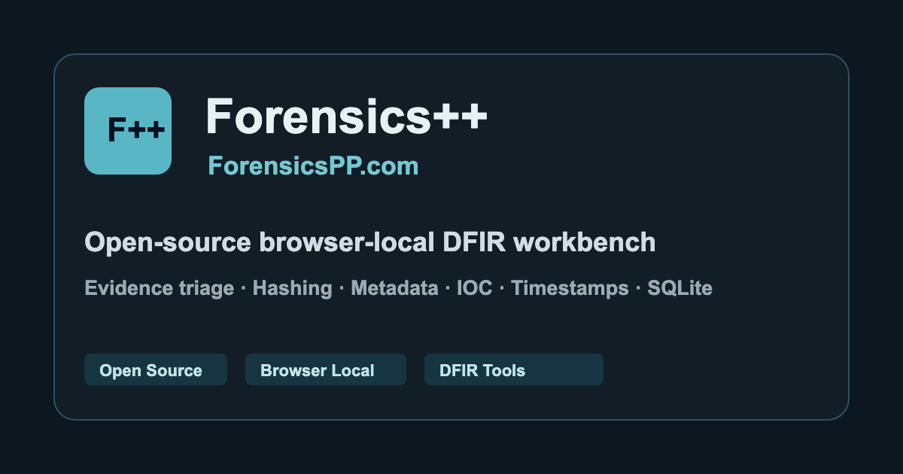

<div align="center">
  <a href="https://www.forensicspp.com/">
    
  </a>

  <h1>Forensics++ Workbench</h1>
  <p>Browser-local DFIR tools · 浏览器端电子数据取证工作台</p>

  <p>
    <a href="https://www.forensicspp.com/"></a>
    <a href="./LICENSE"></a>
    
    
    
    <a href="https://github.com/DyNooob/ForensicsPP"></a>
  </p>

  <p>
    <a href="https://www.forensicspp.com/">Use Online</a>
    · <a href="https://github.com/DyNooob/ForensicsPP">Source</a>
    · <a href="#quick-start">Quick Start</a>
    · <a href="#production-build">Production Build</a>
    · <a href="./CONTRIBUTING.md">Contributing</a>
  </p>
</div>

## About

Forensics++ is a static web application for forensic triage, CTF/MISC, security research, and data inspection. It groups file, image, email, database, log, network, and encoding tools in one interface. Most analysis runs in the browser without a Forensics++ backend.

Forensics++ 是一个用于取证初筛、CTF/MISC、安全研究和数据检查的静态 Web 应用。文件、图片、邮件、数据库、日志、网络与编码工具统一放在同一套界面中；大多数分析直接在浏览器中完成，不依赖 Forensics++ 后端。

The current pre-release is `1.0.0-beta.7`. Source code, tests, build scripts, and release packages are maintained in this repository.

当前预发布版本为 `1.0.0-beta.7`。源码、测试、构建脚本和发布包均在本仓库维护。

## Capabilities

| Area | Capabilities |
| --- | --- |
| Files & Evidence | Hashing, type identification, strings/entropy analysis, standalone Firmware Analyzer (streaming signature scan, entropy map, structure boundaries, recursive container expansion, Firmware Manifest), deep PE/ELF analysis, carved artifacts handed off to the matching analyzer. · 文件哈希、文件类型识别、字符串/熵分析、独立 Firmware Analyzer（流式签名扫描、熵图、结构边界、递归容器展开、Firmware Manifest）、PE/ELF 深度分析、Carved Artifact 直接转交对应分析器 |
| Images & Attachments | Preview, EXIF, PNG structure, channel view, steganography leads, corrupted-image repair attempts, QR decoding, archive listing. · 图片预览、EXIF、PNG 结构、通道查看、隐写线索、损坏图片修复尝试、二维码识别、压缩包目录 |
| Databases | SQLite table browsing and queries, WAL/SHM, page/freeblock/freelist, deleted-record reconstruction, overflow-page reassembly, historical WAL row versions, export. · SQLite 表浏览与查询、WAL/SHM、页/Freeblock/Freelist、Deleted Record 重建、Overflow Page 重组、历史 WAL 行版本、导出 |
| Mail & Network | EML/MSG parsing, HTML body view, headers and authentication results, attachment view, HTTP, URL, IOC, PCAP/PCAPNG, TLS handshake metadata and JA3/JA3S, plus local batch IP/mobile/Chinese-ID/BIN attribution and rule checks. · EML/MSG 解析、HTML 正文查看、邮件头与认证结果、附件查看、HTTP、URL、IOC、PCAP/PCAPNG、TLS 握手元数据与 JA3/JA3S，以及本地批量 IP/手机号/身份证/BIN 归属地与规则核验 |
| System Records | AndroidManifest, APK v1/v2/v3/v3.1 verification with optional v4 `.idsig`, local v2 re-sign, Windows Registry/EVTX, $MFT, $UsnJrnl:$J, Prefetch, LNK, REG. · AndroidManifest、APK v1/v2/v3/v3.1 验证与可选 v4 `.idsig`、本地 v2 重签、Windows Registry/EVTX、$MFT、$UsnJrnl:$J、Prefetch、LNK、REG |
| Disk & Memory | MBR/GPT, FAT root directory, NTFS/exFAT/EXT/ISO metadata, memory/minidump triage, streaming bulk artifact scanner. · MBR/GPT、FAT 根目录、NTFS/exFAT/EXT/ISO 元数据、Memory/Minidump Triage、流式 Bulk Artifact Scanner |
| Documents & Time | PDF, OOXML, OLE, timestamp conversion, timeline assembly, multi-source event merge, versioned `.fppcase` case packages. · PDF、OOXML、OLE、时间戳转换、时间线整理、多源事件合并、`.fppcase` 版本化案件包 |
| Encoding & Security | Encode/decode, base conversion, UUID, JSON, regex, JWT, common password hashes, YARA, CyberChef. · 编码解码、进制转换、UUID、JSON、正则、JWT、常见密码哈希、YARA、CyberChef |

Top-level entries consolidate into workbenches: PNG/QR live in the Images workbench; file identification/strings/entropy/YARA live in the Binary workbench. Legacy links still auto-redirect to the matching workbench.

一级入口按工作台收口：PNG/QR 归入图片工作台，文件识别/字符串/熵/YARA 归入二进制工作台；旧链接仍会自动跳转到对应工作台。

Tools share the same input, result, copy, download, and clear patterns. Large-file analyzers use random or streaming reads where supported. Files extracted by one analyzer can be handed to another without downloading and selecting them again. Structured results may be saved in the optional report package.

各工具采用统一的输入、结果、复制、下载和清空操作。大型文件在支持时使用随机读取或流式读取；分析器提取出的文件可直接交给其他分析器，不必先下载再重新选择。结构化结果可按需保存到报告包。

APK "signature repair" is an explicit re-sign: import your own PKCS#8 private key / X.509 certificate, or generate a temporary repair identity used only locally. Without the original developer's private key you cannot restore the original signing identity; a re-signed APK carries a different certificate identity than the original.

APK 的"签名修复"是显式重新签名：可导入自己的 PKCS#8 私钥/X.509 证书，或生成仅在本地使用的临时修复身份。没有原开发者私钥时无法恢复原签名身份；重新签名后的 APK 与原证书身份不同。

## Current Release

### 1.0.0-beta.7 · 2026-09-26

- **Local attribution workbench**: batch IP/mobile/Chinese-ID/bank-card lookups with rule validation, CSV export, and pinned on-demand data packs cached for offline reuse. · 本地归属地工作台：批量查询 IP/手机号/身份证号/银行卡，规则核验、CSV 导出与按需离线缓存。
- **Workbench launcher**: paste a clue on the redesigned home page and route it directly to the matching local tool. · 工作台式主页：粘贴线索后自动识别并进入合适的本地工具。
- **Clock integrity indicator**: the top bar shows local time and warns clearly when it differs from the same-origin server clock. · 时间完整性提示：顶栏显示本机时间，与同源服务器时间偏差明显时红色告警。
- **Image reveal pass**: common steganography, trailing payload, channel, and repair checks run together and start automatically for newly loaded images. · 图片还原：常见隐写、尾部载荷、通道与修复检查集中执行，并在载入新图片后自动分析。

See [CHANGELOG.md](./CHANGELOG.md) for earlier releases and the full change list.

历史版本和完整变更记录见 [CHANGELOG.md](./CHANGELOG.md)。

## Quick Start

### Use Online

Open [forensicspp.com](https://www.forensicspp.com/) and pick a tool from the home page or the left tool catalog.

在线使用：打开 forensicspp.com，从首页或左侧工具目录选择工具即可。

### Local Development

Requirements:

环境要求：

- Node.js `22.13` or higher · Node.js `22.13` 或更高版本
- npm `10` or higher · npm `10` 或更高版本

```bash
git clone https://github.com/DyNooob/ForensicsPP.git
cd ForensicsPP
npm ci
npm run dev
```

Vite starts the dev server and prints the URL, usually `http://localhost:5173/`.

Vite 会启动开发服务器并输出访问地址，默认通常为 `http://localhost:5173/`。

## Production Build

Build the full static site:

构建完整的静态网站：

```bash
npm run build
```

After the build, `dist/` is the deployable static site. Preview the production build:

构建完成后，`dist/` 即为可部署的静态站点。预览生产构建：

```bash
npm run preview
```

Before releasing, run the full verification gate:

发布前建议执行完整校验：

```bash
npm run verify
```

This runs translation checks, the TypeScript type check, the production build, artifact validation, SEO checks, and the test suite.

该命令会执行翻译检查、TypeScript 类型检查、生产构建、产物校验、SEO 检查和测试套件。

## Static Release Package

Generate a ZIP for static hosting or file distribution:

生成可直接交给静态服务器或文件分发的 ZIP：

```bash
npm run build:standalone
npm run release:package
```

Outputs:

输出文件：

```text
release/ForensicsPP-v1.0.0-beta.7-static.zip
release/SHA256SUMS.txt
```

The ZIP contains the prebuilt static site, with no Node.js launcher. With `build:standalone`, all JS/CSS is inlined into a single `index.html` that opens from `file://` after unzip, and can also be deployed to Nginx, Apache, object storage, or any static host. Use `npm run build` instead when you need subdirectory hosting or on-demand multi-chunk loading.

ZIP 内是已经构建好的静态网站，不包含 Node.js 启动器。使用 `build:standalone` 时全部 JS/CSS 内联进单个 `index.html`，解压后双击即可从 `file://` 打开，也可以部署到 Nginx、Apache、对象存储或其他静态托管平台。需要子目录托管或按需加载多 chunk 时改用 `npm run build`。

## Data & Privacy

Forensics++ requires no application backend. Files and text are processed in the current browser; UI settings and recoverable tool state are saved by the browser. Opening a tool does not upload the original file to a Forensics++ server.

Forensics++ 不要求应用后端。文件和文本在当前浏览器中处理；界面设置和可恢复的工具状态由浏览器保存。打开工具不会把原始文件上传到 Forensics++ 服务器。

IP, mobile-prefix, and administrative-division lookup data is downloaded only when the related lookup is used, then cached by the browser. Data-pack source, version, checksum, and cache state are shown under **Settings → Local Data**.

IP、手机号段和行政区划数据只在使用对应查询时下载，之后由浏览器缓存。数据源、版本、校验值和缓存状态可在 **设置 → 本地数据** 查看。

Browser storage only improves continuity of use and does not replace formal evidence custody, read-only imaging, evidence intake, or report archiving. Before handling sensitive data, confirm your browser configuration, extensions, and runtime environment meet your requirements.

浏览器存储只用于提升连续使用体验，不替代正式的检材保管、只读镜像、证据登记或报告归档。处理敏感数据前，请确认当前浏览器配置、扩展和运行环境符合你的工作要求。

You can view storage usage and clear Forensics++ settings and workspace under **Settings → Local Data**.

你可以在 **设置 → 本地数据** 查看存储占用，并清除 Forensics++ 保存的设置和工作区。

## Deployment

`main` is deployed by [`.github/workflows/pages.yml`](./.github/workflows/pages.yml). The workflow installs the locked dependency tree, runs `npm run verify`, uploads `dist/`, and deploys it with GitHub Pages. The custom domain is defined by `public/CNAME`.

`main` 分支由 [`.github/workflows/pages.yml`](./.github/workflows/pages.yml) 部署。工作流使用锁文件安装依赖、执行 `npm run verify`、上传 `dist/`，再发布到 GitHub Pages；自定义域名由 `public/CNAME` 定义。

## Project Structure

```text
src/components/   Shared UI, ToolHost, and the tool runtime registry
src/config/       Tool catalog, version, and open-source dependencies
src/core/         EvidenceReader, analyzer routing, tool handoff, analysis core
src/features/     Parsers, AnalysisEnvelope, analyzers, and web workers
src/tools/        Tool pages
src/utils/        Storage, file, copy, and general helpers
tests/            Unit and parser tests
scripts/          Build, release, artifact validation, and layout audits
public/           Site assets, legal notices, and bundled static tools
docs/             Release and development documentation
```

## Common Commands

| Command | Purpose |
| --- | --- |
| `npm run dev` | Start the dev server |
| `npm run test` | Run the test suite |
| `npm run typecheck` | Run the TypeScript type check |
| `npm run build` | Build the production static site |
| `npm run verify` | Test and build |
| `npm run preview` | Preview the production build |
| `npm run audit:layout` | Check tool layout and key interactions |
| `npm run release:package` | Generate the static release ZIP and checksums |

| 命令 | 用途 |
| --- | --- |
| `npm run dev` | 启动开发服务器 |
| `npm run test` | 运行测试 |
| `npm run typecheck` | 执行 TypeScript 类型检查 |
| `npm run build` | 构建生产静态文件 |
| `npm run verify` | 测试并构建 |
| `npm run preview` | 预览生产构建 |
| `npm run audit:layout` | 检查工具布局和关键交互 |
| `npm run release:package` | 生成静态发布 ZIP 和校验文件 |

The layout audit uses the local Chrome and hits port `5173` by default. If the dev server uses another port:

布局审计默认使用本机 Chrome，并访问 `5173` 端口。如开发服务器使用其他端口：

```bash
AUDIT_URL=http://localhost:5174 npm run audit:layout
```

## Contributing

1. Fork the repo and create a feature branch.
2. Keep tool input, result, error, and clear operations consistent with existing workbenches.
3. Add tests for parsing logic or edge behavior.
4. Run `npm run verify` before committing.
5. Do not upload real evidence, credentials, personal information, or unauthorized data when filing issues.

1. Fork 仓库并创建功能分支。
2. 保持工具输入、结果、错误和清空操作与现有工作台一致。
3. 为解析逻辑或边界行为补充测试。
4. 提交前运行 `npm run verify`。
5. 提交问题时不要上传真实检材、凭据、个人信息或未经授权的数据。

See [`CONTRIBUTING.md`](./CONTRIBUTING.md) for fuller conventions, [`docs/ARCHITECTURE.md`](./docs/ARCHITECTURE.md) for the analysis architecture, and [`docs/RELEASE.md`](./docs/RELEASE.md) for the release process.

更完整的开发约定见 [`CONTRIBUTING.md`](./CONTRIBUTING.md)，分析架构见 [`docs/ARCHITECTURE.md`](./docs/ARCHITECTURE.md)，发布流程见 [`docs/RELEASE.md`](./docs/RELEASE.md)。

## Security

Contact the maintainer via the email published in [`SECURITY.md`](./SECURITY.md). Do not attach real evidence, passwords, access tokens, or full exploit details in a public Issue, Pull Request, or the first message of an email.

请通过 [`SECURITY.md`](./SECURITY.md) 中公布的邮箱联系维护者。请不要在公开 Issue、Pull Request 或邮件首条消息中附上真实检材、密码、访问令牌或完整利用细节。

## License & Contact

This project is licensed under the [MIT License](./LICENSE).

本项目使用 [MIT License](./LICENSE)。

- Repository: [DyNooob/ForensicsPP](https://github.com/DyNooob/ForensicsPP)
- Website: [forensicspp.com](https://www.forensicspp.com/)
- Feedback: `toolab@digiforensics.cn`
